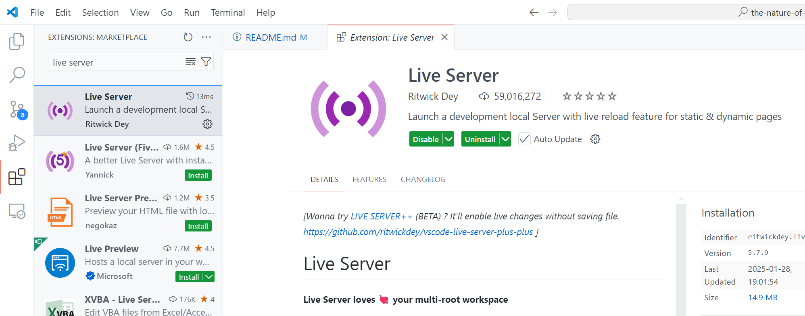
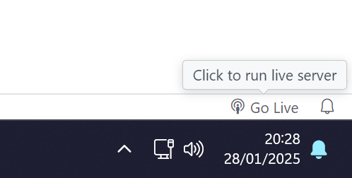
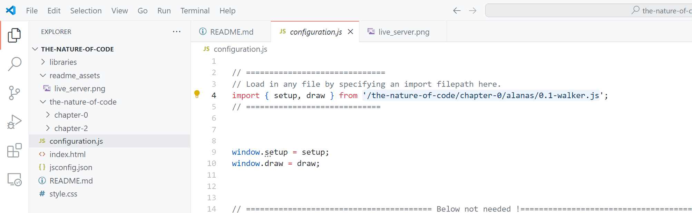
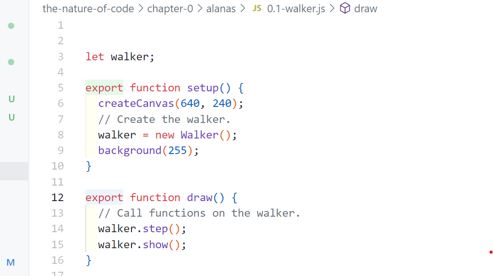

# the-nature-of-code
A repo for hosting code workings while reading; The Nature of Code by Daniel Shiffman.
Hosted on GitHub to allow for collaboration / excercise sharing.

## Setup
This guide assumes that you'll be using Visual Studio Code as your code editor.
Can be downloaded from here:
https://code.visualstudio.com/

The only thing required to run the code is the 'Live Server' extention.
This is used to locally host this repository/folder/file directory as just files over HTTP.

So if not using VS Code, alternatives exist.

## Running the Code
There should be a Live Server Start Buton somewhere in your UI. eg.:

Starting it should open your browser, or by default it will host on port 5500 locally.
http://localhost:5500/

## Swapping Excercises / Drawings
The project's code start in 'configuration.js' in there all that's needed is to point to the file you want to run.

Unlike what's shown in the book, both the setup() and draw() functions need to be prefixed with 'export' to make this swapping functionality work work.

  

# More help
If more help is needed refer to the official resources, eg.

Introductory tutorial to p5.js by Daniel Shiffman (also mentioned in the book, this is the what we're using to draw): https://thecodingtrain.com/tracks/code-programming-with-p5-js

The online book resource itself: https://natureofcode.com/
